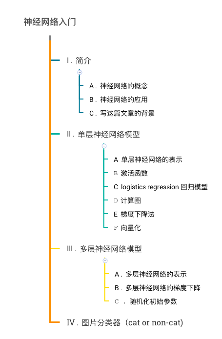
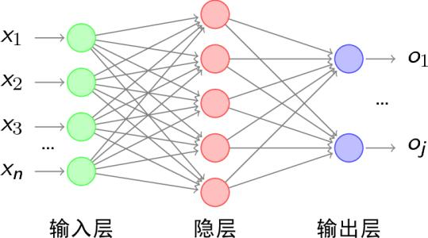
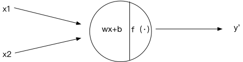

# 
 神经网络入门

 

## 一：简介
###1、前言
 人工智能已经应用到了各行各业，市场上对人工智能人才的需求量已经远远大于目前在人工智能领域中从业的人数。人工智能的核心是深度学习，因此学习人工智能需要从深度学习算法入手。感谢在线教育平台<link，将吴恩达的课程引进国内，最近在学习过第一节课后写下这篇博客，来总结分享这一课中的知识点，也希望与阅读这篇文章的同学一起交流学习，如文章中有不正确，不合适的地方，敬请批评指正。
###2、神经网络概念
 人工神经网络是一种应用类似于大脑神经突触联接的结构进行信息处理的数学模型。在工程与学术界也常直接简称为“神经网络”或类神经网络。[1]
 
 

 其中X1,X2,...,Xn为特征向量，特征向量经过隐含层的处理，最终会得到输出层。隐含层的数量以及每个隐含层中神经元的个数都是可以根据问题进行设定的，具体设定的方法还有待探索，一般来说需要多试一试。

###3、神经网络的应用
借用知乎上某优秀回答者的话，神经网络是很萌的。神经网络的应用非常广泛，一个我们非常常见的例子就是分类器，例如，垃圾邮件识别，疾病诊断，图片分类器等。文章的最后的案例就是一个图片分类器的例子。高大上的例子主要有一些大型的神经网络，可以用来做物体识别，比如人脸识别等。2012年多伦多大学Krizhevsky等人构造了一个超大型卷积神经网络，有9层，共65个神经元，6千万多个参数。网络输入的是图片，输出的是1000个类，比如各种动物和生活用品等，这个模型的训练需要输入海量的数据，它的准确率也超过了先前所有的分类器。

## 二：单层神经网络模型
简介说了这么多，可能把神经网络说的有点玄乎了，其实神经网络的原理非常简单，下面我们先同个单个神经元模型来了解一下神经网络的一些基本原理，然后在介绍一下单层神经元网络。
###1、单个神经元模型
 
 

 如上图所示
###2、单层神经元模型
###3、logistics regression
## 三：多层神经网络模型
## 四：图片分类器实例（cat or non-cat）
  